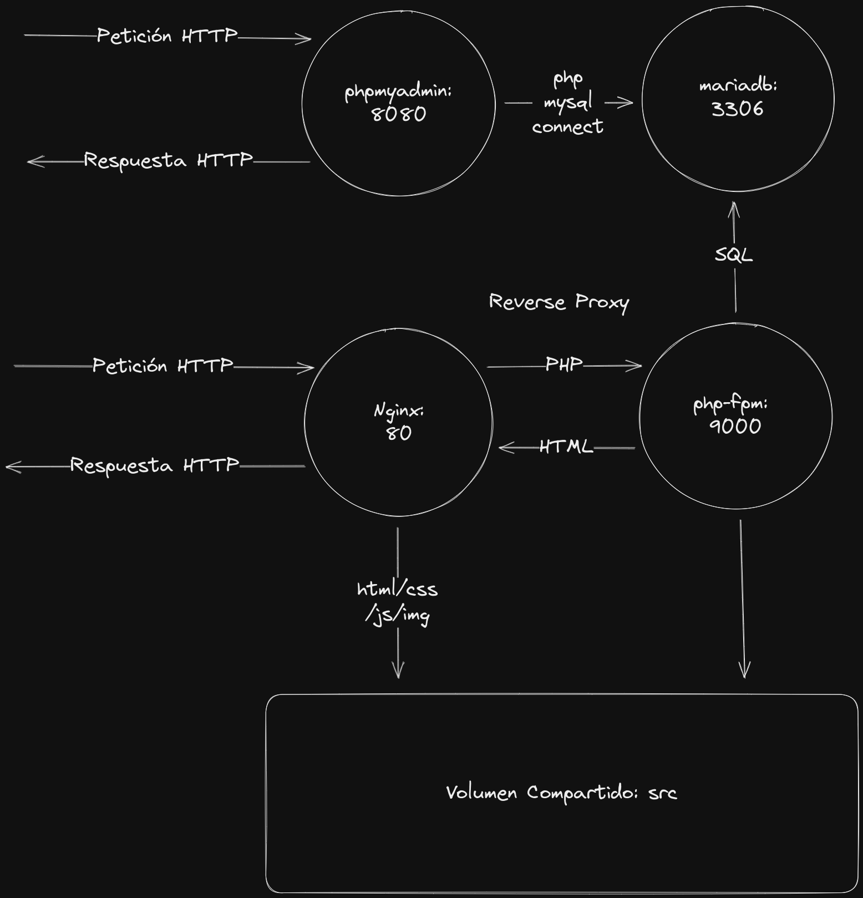

# Entorno de Ejecución de Aplicaciones PHP con Docker y Docker Compose

# Instalación
* Deberás tener instalado:
  * Docker
  * Docker Compose
# Lanzamiento del Entorno
docker compose up -d --force-recreate

# URLS de acceso:
* Entorno PHP: http://localhost:80 (deberías ver el phpinfo.php)
* Entorno PHPMyAdmin: http://localhost:8080 (usuario: test/test)

# Parada del Entorno
docker compose down

# Carpetas Importantes:
* src: código php
* conf: fichero de configuración de nginx y PHP
* db-data: volumen de datos de BBDD

# Fichero Dockerfile
Este fichero permite generar una imagen docker para crear 
un entorno PHP-FPM con la versión de PHP específica.
Permite también elegir las extensiones de PHP que necesitemos.
La primera vez que carguen los contenedores con el docker compose, 
Creará la imagen de PHP-FPM, por lo que el primer arranque tarará 
un poco más que el resto de veces

## Entorno Producción
docker compose -f docker-compose-prod.yaml up -d --force-recreate

## Entorno Moodle
- ./init-moodle.sh # esto crea un enlace a la carpeta moodle desde src
- copia el contenido del fichero moodle.tgz descomprimido a la carpeta moodle
- docker compose -f mi-docker-compose-moodle.yaml up -d --force-recreate
- Entra a [http://localhost/](http://localhost/)
- La bbdd está disponible en:
  - host: db
  - database name: test
  - username: test
  - password: test
- Si necesitas cambiar estos valores vete al fichero docker-compose-moodle.yaml

